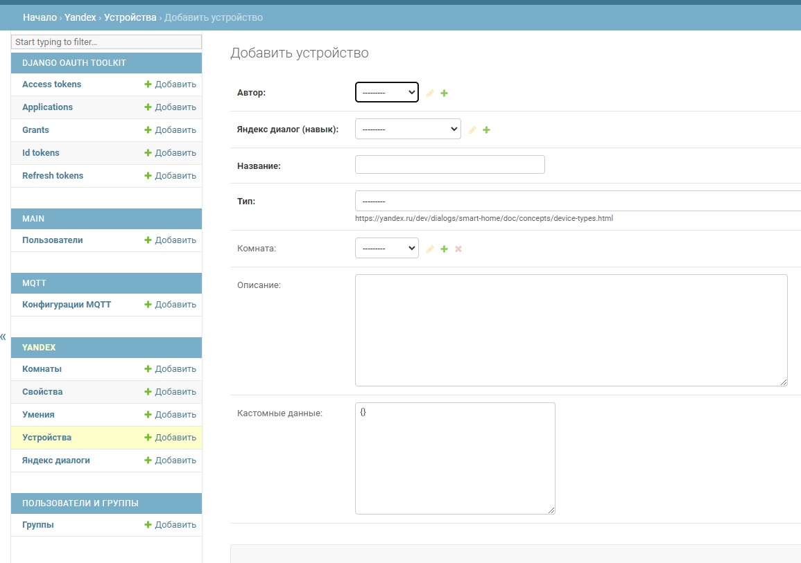
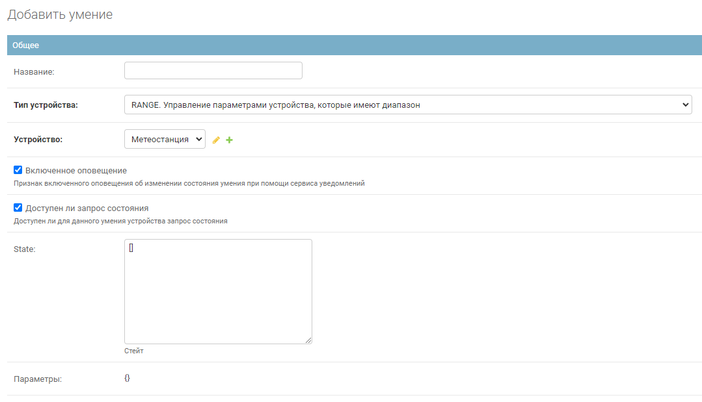
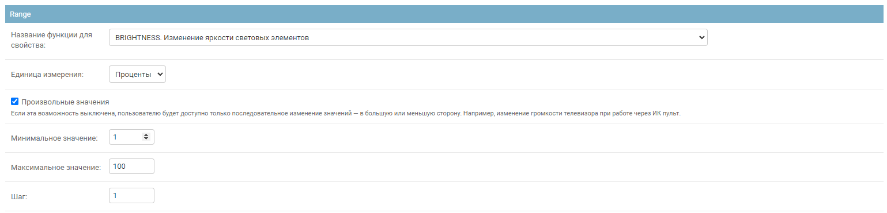

## Как добавить устройство

1. В django админке добавляем устройство

   

2. Далее созданному устройству добавляем Умения(Capability), если им можно управлять
   или Свойства(Properties), если это какие-либо датчики

   Обязательно нужно указать тип устройства и указать умение/свойство какого именно устройства мы будем добавлять
   

   В зависимости от типа устройства ниже нужно будет найти раздел с этим типом и заполнить там все необходимые поля.
   На примере с RANGE это будет раздел "Range"
   

   Для умений в разделе mqtt есть топик для команд, в который устройство будет слать информацию для управления
   И для умений, и для свойств есть топик для текущего состояния устройства, которое будет обновляться автоматически при
   запуске проекта.
   JsonPathRetriever нужен, если ваш топик возвращает данные в формате json. Если это Boolean/Float/Int/String, то
   оставьте пустым
3. Сохраняем. Если при валидации формы возникнут ошибки - следуйте указаниям.
4. После того как добавили все устройства и их возможности, переходим в умный дом Яндекса и обновляем список устройств
