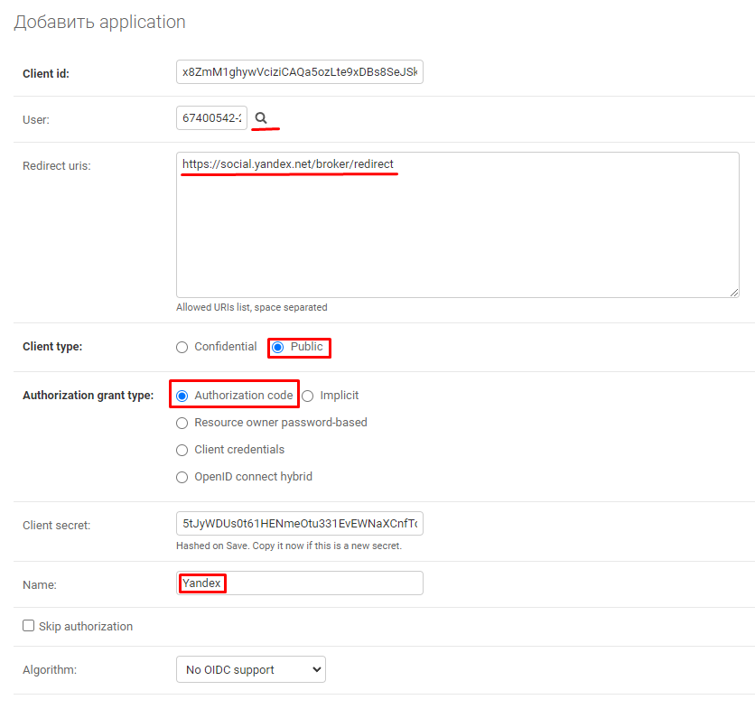
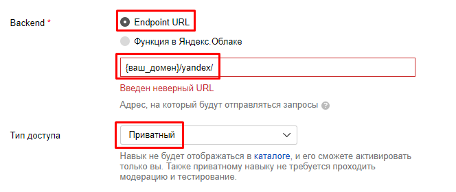
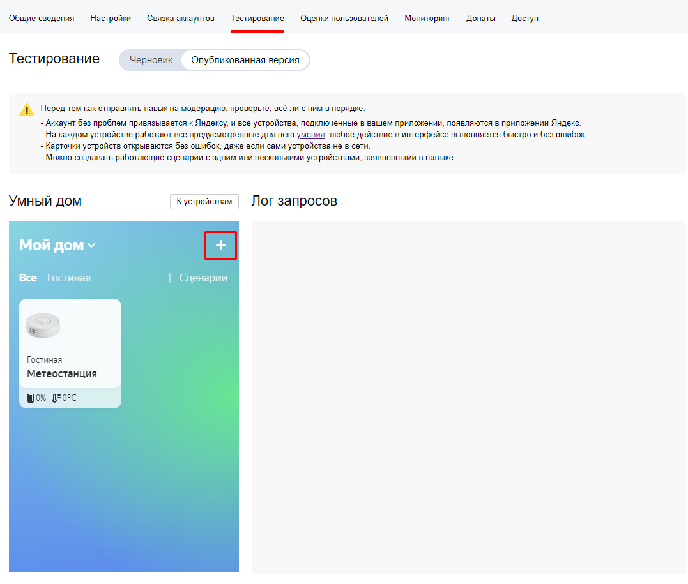

## Как настроить проект и Яндекс навык

### Настройка в админке django

1. Заходим в админку по адресу, который указан в `ALLOWED_HOSTS`/admin/`, логинимся по тем доступам, которые создали на
   этапе `createsuperuser`
2. Создаём OAuth приложение. Устанавливаем следующие
   настройки `Redirect uris`: `https://social.yandex.net/broker/redirect`

   

   `Client secret` придётся немного подрезать по длине, так как у Яндекс есть ограничение на его длину

   

   `Client id` и `Client secret` нам пригодятся далее.
3. Добавляем конфигурацию MQTT
   

### Настройка Яндекс навыка

1. Заходим в [платформу диалогов Яндекса](https://dialogs.yandex.ru/developer "Платформа диалогов") и создаём там новый
   навык
2. Заполняем настройки:
   Вкладка `Настройки`
   
   Вкладка `Связка аккаунтов`
   `{ALLOWED_HOSTS}`, `{ALLOWED_HOSTS}/oauth/authorize/`, `{ALLOWED_HOSTS}/oauth/token/`
   
3. Публикуем навык

После настройки навыка Яндекс, возвращаемся в админку django и добавляем информацию о нашем навыке.

OAuth токен получаем по [этой](https://dialogs.yandex.ru/developer "Платформа диалогов") ссылке, далее нужно будет
нажать `OAuth-токен для Диалогов`

ID навыка можно скопировать из адресной строки открытого навыка или на вкладке `Общие сведения` в
разделе `Идентификатор диалога`

### Связываем аккаунты проекта и Яндекс навыка

1. Вкладка `Тестирование`.
   
3. Выбираем `Опубликованния версия`
4. Выбираем устройство нового дома. Автоматически выберется наш навык. Жмём кнопку "привязать к яндексу"
5. Вводим логин и пароль вашего пользователя которого создали на этапе `createsuperuser` и авторизовываем приложение

На этом настройки закончены. Проект и Яндекс навык настроены, аккаунты связаны.